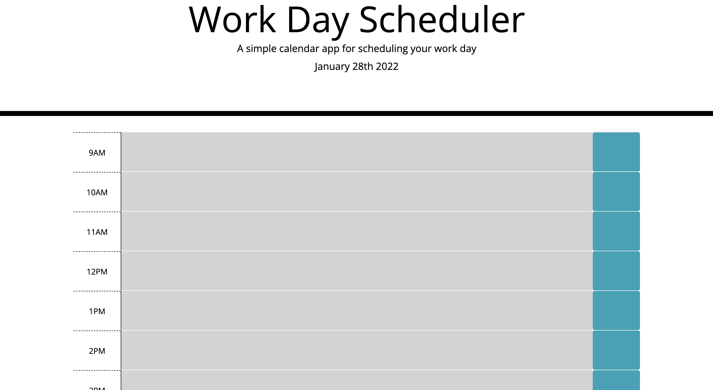

# work-day-scheduler
a scheduler to log events

## Description

I built this simple day planner with the functionality to input and save hourly events throughout a standard workday to keep the user organized and oriented. I learned how to connect a current moment function and compare it with existing elements to colour-code based on time of day and how to save objects into local storage and recall so that they do not disappear upon reload of the page. 

## Deployment

Deployed at: https://doshpocket.github.io/work-day-scheduler/
GitHub: https://github.com/DoshPocket/work-day-scheduler

## License
This build is licensed under Apache 2.0. (https://www.apache.org/licenses/LICENSE-2.0).
---
🏆 
## How to Contribute
Feel free to contribute further to my code within the standards of The [Contributor Covenant](https://www.contributor-covenant.org/). Happy coding!

